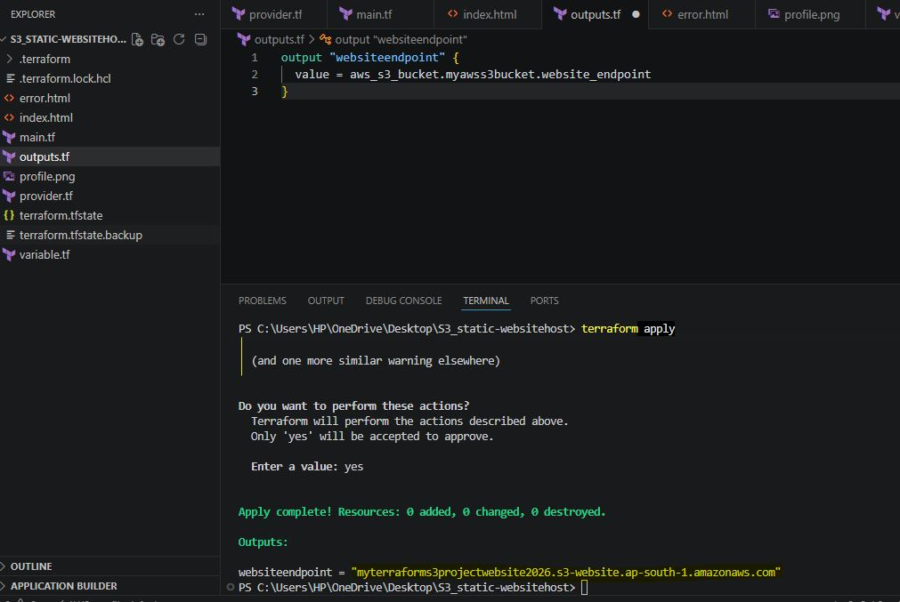
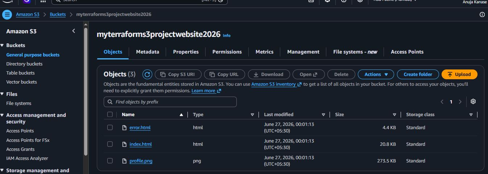
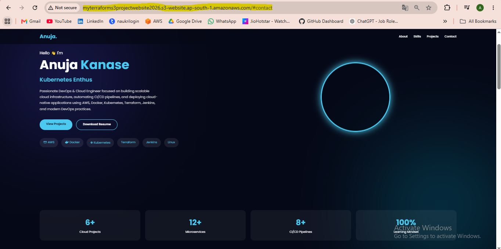

# 🚀 AWS S3 Static Website Hosting using Terraform

Deploy a responsive **personal portfolio website** on **Amazon S3** using **Terraform**. This project demonstrates how to provision AWS infrastructure with **Infrastructure as Code (IaC)** instead of manually configuring resources through the AWS Management Console.

---

## 📖 Overview

This project provisions an **Amazon S3 bucket**, enables **Static Website Hosting**, configures the required bucket policy, and uploads the website files using **Terraform**.

The website is built with **HTML, CSS, and JavaScript** and includes:

- 👤 Personal Portfolio
- 💼 Projects Section
- 🛠 Skills Section
- 📞 Contact Section
- ⚠ Custom 404 Error Page
- 📱 Responsive Design

---

# 🏗 Architecture

```
                +--------------------+
                |   Terraform CLI    |
                +---------+----------+
                          |
                          |
                 terraform apply
                          |
                          v
              +----------------------+
              |     AWS S3 Bucket    |
              +----------+-----------+
                         |
      -----------------------------------------
      |                 |                     |
      |                 |                     |
 index.html       error.html          profile.png
      |
      |
      v
 Static Website Hosting Endpoint
      |
      v
     Browser
```

---

# 📂 Project Structure

```
terraform-s3-static-website/

│── index.html
│── error.html
│── profile.png
│── main.tf
│── provider.tf
│── variables.tf
│── outputs.tf
│── README.md
│
├── Screenshots

```

---

# ⚙ Technologies Used

- ☁ AWS S3
- 🏗 Terraform
- 💻 HTML5
- 🎨 CSS3
- ⚡ JavaScript
- 🔐 AWS IAM

---

# ✨ Features

- Infrastructure as Code (Terraform)
- Amazon S3 Static Website Hosting
- Public Read Bucket Policy
- Automatic Website File Upload
- Responsive Portfolio Website
- Custom Error Page
- Easy Deployment
- Easy Cleanup using Terraform

---

# 📦 Terraform Resources

This project provisions:

- AWS Provider
- S3 Bucket
- Bucket Ownership Controls
- Public Access Block Configuration
- Bucket Policy
- Static Website Hosting
- Object Uploads

---

# 🚀 Deployment Steps

## 1 Clone Repository

```bash
git clone https://github.com/anujakanase/Terraform-S3_static_website_host.git

cd Terraform-S3_static_website_host
```

---

## 2 Initialize Terraform

```bash
terraform init
```

---

## 3 Preview Infrastructure

```bash
terraform plan
```

---

## 4 Deploy Infrastructure

```bash
terraform apply
```

Type

```
yes
```

when prompted.

Terraform will create:

- S3 Bucket
- Website Configuration
- Bucket Policy
- Upload Website Files

---

## 5 Open Website

After deployment Terraform outputs the website endpoint.

Example:

```
http://bucket-name.s3-website-region.amazonaws.com
```

---

# 🗑 Destroy Infrastructure

To avoid unnecessary AWS charges:

```bash
terraform destroy
```

This removes all AWS resources created by Terraform.

---

# 📚 What I Learned

- Infrastructure as Code (IaC)
- Amazon S3 Static Website Hosting
- Terraform State Management
- Bucket Policies
- AWS IAM Permissions
- Automating Infrastructure Deployment
- Managing Cloud Resources Efficiently

---

# 📷 Screenshots

## Terraform Apply

```
terraform apply
```

<p align="center">

</p>

---

## AWS S3 Bucket

<p align="center">

</p>

---

## Static Website Hosting

<p align="center">

</p>

---

# ⭐ Support

If you found this project helpful, consider giving it a ⭐ on GitHub.

It motivates me to build and share more DevOps and Cloud projects.

---
